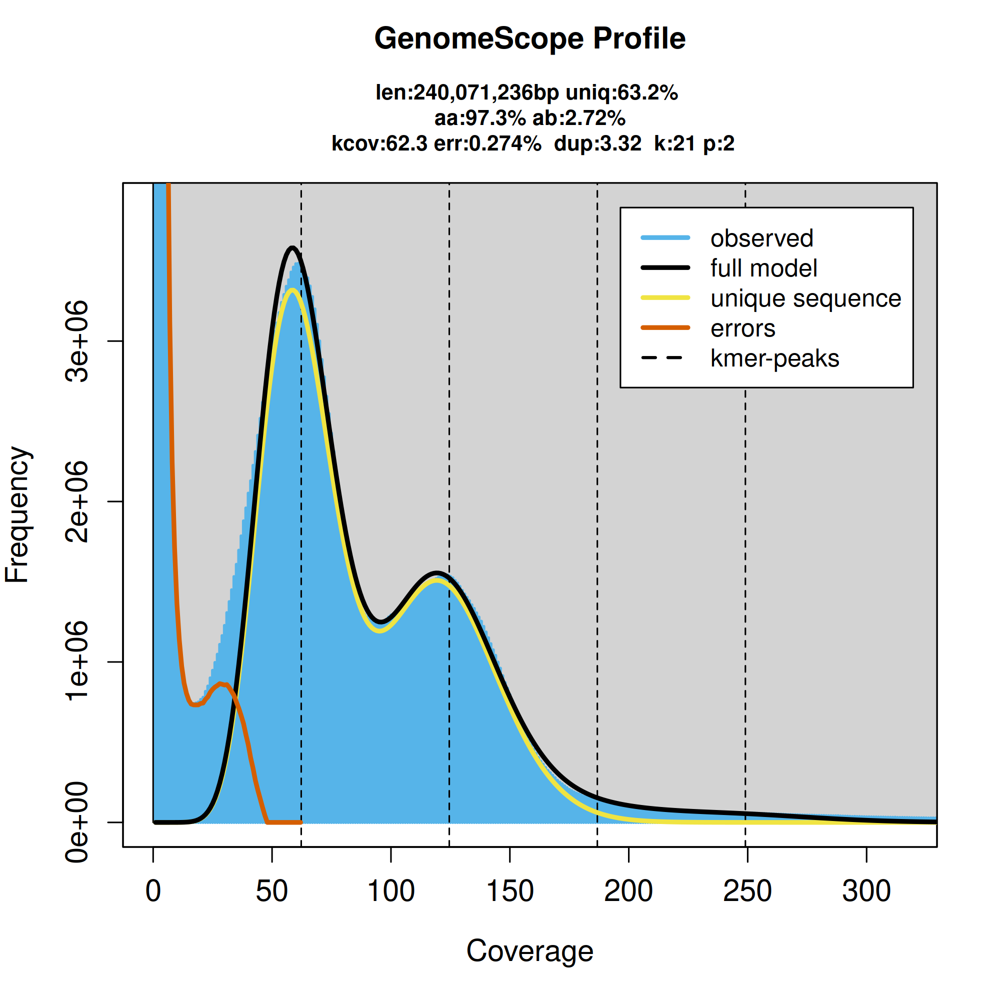

# 基因组组装(Genome Assembly)

A WGS workflow consists of five steps: DNA isolation, library preparation, sequencing, assembly, and annotation.
First, genomic DNA is purified using one of a variety of methods, including phenol-choloroform, bead beating, or enzymatic lysis55. Second,the sequencing library is prepared by attaching adapters and barcodes. This can be done via ligation, which involves shearing the DNA to create free ends for DNA ligase to attach adapters, or tagmentation, which randomly inserts adapter attachment points without shearing. 
Third, the library is sequenced with a next generation sequencing (NGS) platform that either generates short reads (150–300 base pairs long) with high nucleotide accuracy or long reads (1.5 kilobases to megabases long) with lower accuracy. The average read length and the number of reads (genome coverage) output by the NGS platform is dependent on sequencing technology and the preceding DNA isolation and adapter attachment steps. 
Fourth, the reads are computationally assembled into a final genome sequence with software that uses either an overlap-layout-consensus (OLC) or De Bruijn graph (DBG) algorithm. OLC and DBG assemblers are further classified into short read only, hybrid (both short and long reads), or long read with error correction. Both hybrid and long read with error correction assembly approaches currently hold the most promise to achieve accurate genome sequence and structure at low read depths, primarily because two independent technologies validate basecalls. However, this entails the use of two sequencing technologies, thereby increasing costs and time. 
Fifth, an annotation is performed. Eukaryotic annotation involves first predicting genes in the genome sequence, followed by functional
annotation. However, features like telomeres, centromeres, mitochondrial DNA, and natural plasmids are often not annotated, and several are by convention not included in the final assembly.

* 本章视频：Sequencing the virus.mp4

### 基因组调查(Genome Survey)
通过二代测序(30X)，利用K-mer分布（K-mer长度一般是17或21），估算基因组大小，杂合度、重复序列比例、GC含量等。在高杂合口基因组中，由于存在杂合位点，部分K-mer会被分为两个亚型，进而导致测序深度减半，使得K-mer计数也减半。因此，在K-mer曲线上，主峰前约在横坐标的1/2处会出现一个小峰，该小峰对应的测序深度值大约是主峰处深度的一半。当基因组的杂合度越高时，这个小峰就越明显。

### 组装质量评估
TotalContigLength(t): total length of all contigs of length at least t.

N50 = maximal contig length t such that TotalContigLength(t) is at least 50% of the total length of all contigs.

